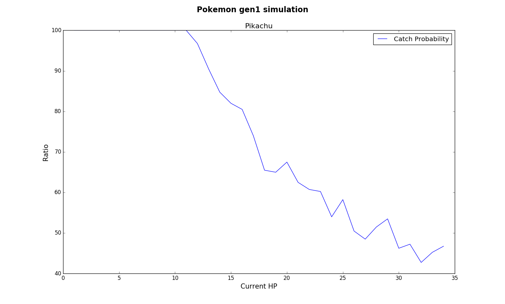
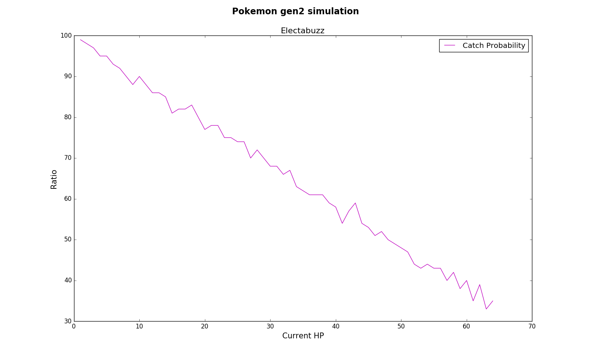
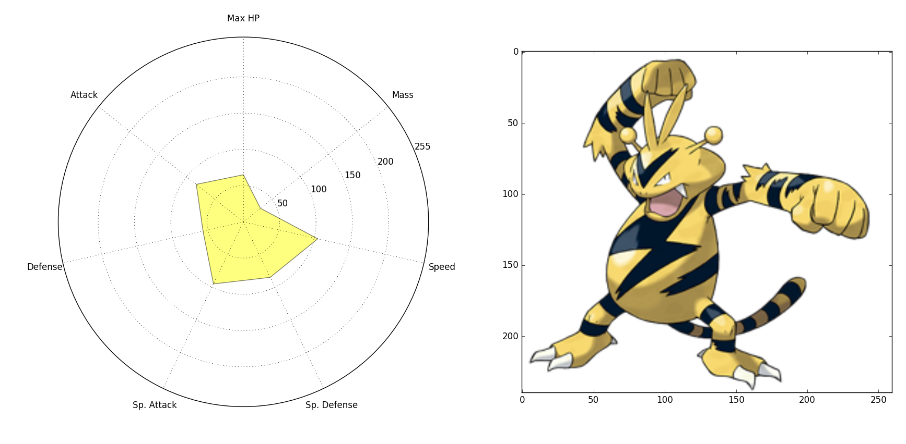
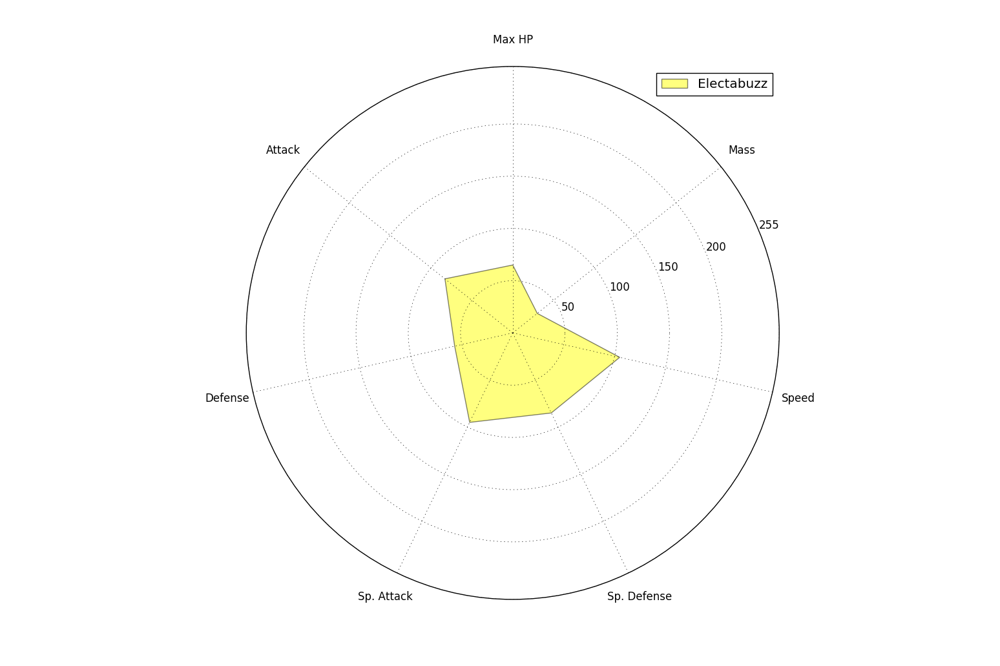
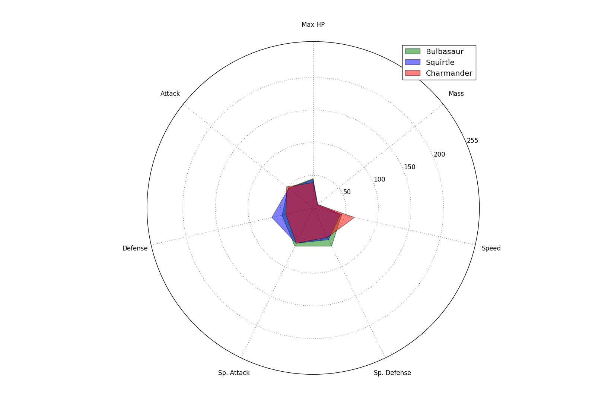
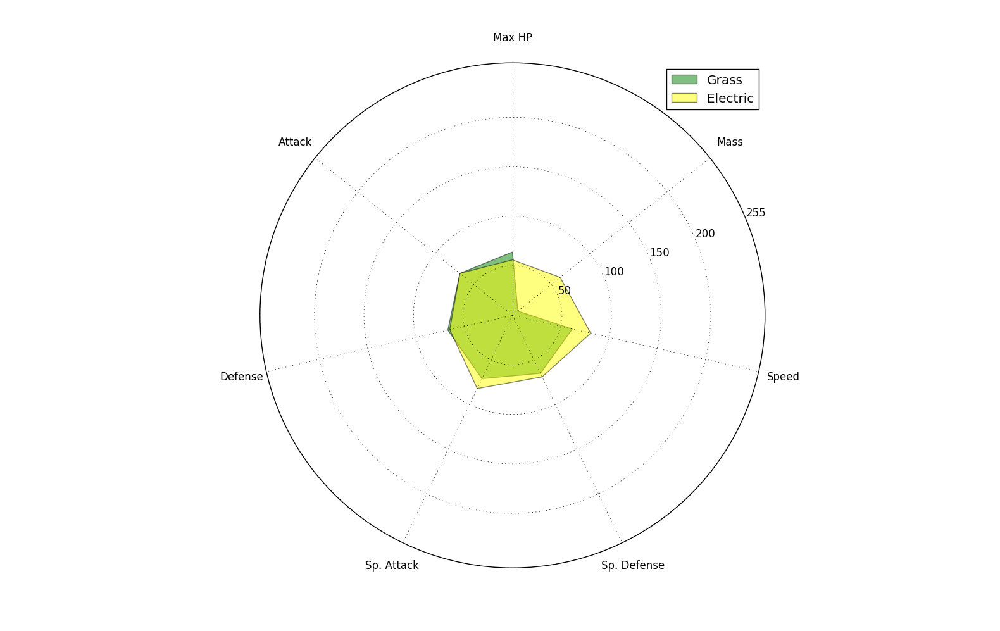

# POKéMON

## Gotta plot em all

The python code is easy to use and can easyly be extended. For easy creation of Pokémons a sqlite3 database is created with various stats. Many objects are based on enum usage, which avoids usage of strings.

It is very easy to create a Pokémon object.

```python
pokemon = Pokemon(PokemonType.Pidgey, state = State.asleep)
# or
pokemon = Pokemon(PokemonType.Pidgey) # for normal state 
```

BTW, this project is not finished yet, so bugs may appear.

### Example of usage

#### Simulation of catch rate generation I
Use any Pokémon to simulate the catch rate of generation I Pokémon.
<p align="center">

</p>

#### Simulation of catch rate generation II
Use any Pokémon and Pokémon ball to simulate catch rate of Pokémon generation II.

<p align="center">

</p>

#### Plot stats of a Pokémon
Plot the stats of any Pokémon in a spider net plot.

The following code snippet will also plot the Pokémon-figure to the right of the plot.

``` python
import pokemon_plot # other imports are omitted here, see pokemon_tests.py for imports

pokemon = Pokemon(PokemonType.Electabuzz, State.normal)
pokemon_plot.plotPokemon(pokemon)
```

<p align="center">

</p>


For only plotting the stats:

``` python
import pokemon_plot

pokemon = Pokemon(PokemonType.Electabuzz)
pokemon_plot.plotPokemons([pokemon])
```

<p align="center">

</p>

#### Compare Pokémons
Compare Pokémons in a spider net plot.

The code needed for generating the plot below is simple:

``` python
import pokemon_plot 

pokemon1 = Pokemon(PokemonType.Bulbasaur)
pokemon2 = Pokemon(PokemonType.Squirtle)
pokemon3 = Pokemon(PokemonType.Charmander)

pokemonList = [pokemon1, pokemon2, pokemon3]
pokemon_plot.plotPokemons(pokemonList)
```

<p align="center">

</p>

#### Compare Pokémon classes
Compare different Pokémon classes in a spider net plot. Just get the Pokémon class/type and compare them with:

``` python
import pokemon_plot 

pokemon_plot.compare_classes([PokemonClass.Grass, PokemonClass.Electric])
```

<p align="center">

</p>